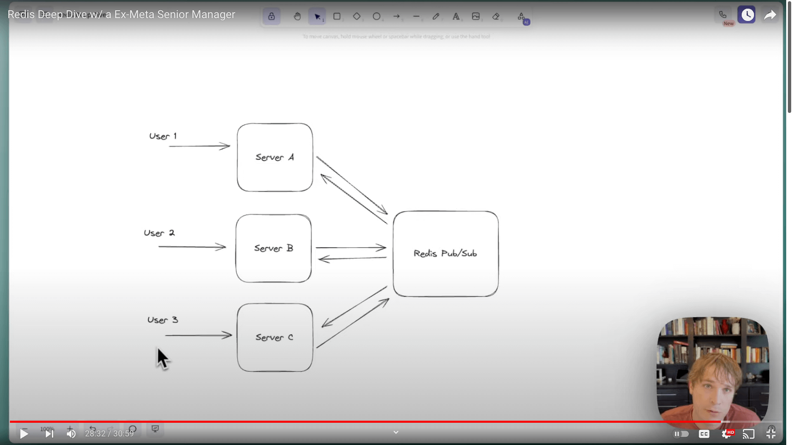

Versatile tech, used in:
- caches
- distributed locks
- leaderboards
- a replacement for kafka and ...

Single-threaded, in-memory, data structure server.

- Single-threaded is unusual in distributed systems because it can't utilize multiple cores. But it simplifies things a lot.
In many DBs the order of ops is hard to grasp. But in redis it's simple, the first req that comes in, is the first one that runs
and every other req waits. 
- In-memory: Lightning fast. But it can't guarantee the durability of data. In a sql db, you need to batch the reqs, otherwise,
we would run into problems like N+1 problem. But with redis, we can fire off a thousand reqs and the server will return the res fast. 
- Data structure server: the core of redis is key-value dictionary.

## Infra configs
Redis uses the keys to handle the multi-node envs.

### Replicated
In the replicated env(master and slave), the slave(secondary) gonna read from the append-only file(log) of the master to catch up with
the changes on the master. This is similar to change data capture(CDC) in the way that when a command runs successfully on the master,
it gets run on the secondary. There is a special behavior in redis where if there's been 5 mins or an hour and the secondary has not got
an update from the master, then the secondary will fully rebuild from the contents of the master node. But in most cases,
slave is gonna caught up to master.

But this infra config is not very interesting. Because it's gonna restrict us to the throughput of only the master node. So by increasing
the number of slave nodes(replicas), we're increasing the read throughput, but we can't scale writes. This is where the keyspace
starts coming into the picture.

### Cluster
Redis has a concept called `slot` which is a hash of the key(usually a CRC) modulo some number(16384) and that is the slot that the
key is in.

Theoretically when the cluster isn't resizing, a single master or main will own that slot and clients should be aware of all of the 
server nodes in the cluster. So if client wants to request for the key `foo`(to get it's val), it hashes the key and look up the
slot that it's in and then decide which node in the cluster to route the req to?

Each node in the cluster communicates via a gossip protocol, so they all know about the existence of each other as well as which
slots they have and if the client makes a req to the wrong node, it will tell client that key doens't exist here, it's been moved,
but for performance sake, it's way more faster if the client knows exactly which node to send the req to.

So that's why when you start up a client in redis, you make it aware of all the hosts(server nodes) that are available.
You theoretically aren't making reqs that go through many different nodes to find the node that has that key.

The keyspace is important. The only way to shard redis is through choosing the keys and then when you're choosing how to shard,
you're basically choosing how to spread the data across the keyspace. An example:

When you have a cache, one of the major difficulties is the hot-key problem where many of the reqs are asking the same key.
So the node that has that key can't handle the load that is unevenly distributed. What can we do?

There are a couple of options. Look at the article.

One of the common patterns is: First write the same key that is requested a lot to multiple nodes, so we can read it from
not one but multiple nodes, then appending a random number to the key and it will randomly go to one of the nodes that has that key.

This is a crude way to distribute the load across the cluster.

To scale redis, you should think about your key space.

## Capabilities
### redis as a cache
Appropriate in any case where you can tolerate some staleness or inconsistency, or in other words, when you 
have an eventually consistent system.

When we set up cache like this, we have 2 concerns:
1. hot-key problem: we need to make sure the load for the cache is spreading the load amongst all the instances of cache. The way we
do this in redis is by assigning keys. We might append values to the requested keys such that we are evenly distributing the reqs across
all the redis nodes. By doing this, the reqs are not going to the same node every time.
2. expiration policy: redis supports all policies. 
    - We can use the `EXPIRE` command.
    - LRU setup: you continue adding keys to the cache until you run out of memory and then at that point, redis will start to evict
      the least recently used keys. Works like memcached.

### Redis as rate limiter
Most basic implementation of rate limiter:

We want to guard an expensive service from getting lots of reqs from one client or all of them. So maybe our downstream(the expensive
service which is down the road in the journey of a user req) has decided that they can only accept 5 reqs every 60 secs.
So we need to be sure if we have multiple instances of the client services that call the expensive service, they aren't all
making more than 5 reqs over 60 secs.

We can have a key that we INCR it everytime a req comes in and if it's more than 5, we can't continue the req. Also we need
to use `EXPIRE` on this key and it's expiry time is 60 secs.

Note: The service needs to do redundant calls after it gets rate-limited, because it needs to know when the rate-limit has expired.
It can do that everytime it gets a new req. So it first checks if it can proceed or not.

There is another problem: our design doesn't work well when rate limits are under stress. Because all the services are
hitting redis at the same time and we don't have specific ordering that is gonna enforced, so **we might starve one service.**

---

To improve this setup, We can add windows and give clients some idea about when they might be next in line.

### streams
Redis streams are ordered list of items with an id which is a timestamp as they're inserted.

We can use this for an async job queue. We wanna be able to insert items into that queue and have them processed in order and reliably.
We wanna make sure if an item is inserted into the queue, then it will eventually get processed.

The consumer group is like a pointer into the stream defining where we're at.

The workers query the consumer group for unallocated items

**Claiming:** At any given moment, only one of these workers can have claimed an item on the consumer group and if the worker fails,
then that item can be reclaimed by the consumer group and allocated out to another worker.

So redis streams gives us a way to distribute work amongst workers in a way that's fault-tolerant (partially, because of normal redis caveats)
and that is very fast.

Considerations:
1. we need to handle failures of redis. We can use fork of redis named memorydb that gives us more reliability. We can also have
redundancy by having replications.
2. how to keep the workers allocated the right work? The typical way is the worker while it's processing an item, will continue to
heartbeat back to the consumer group, letting it know: hey, I'm still working on this item. That way, the consumer group isn't 
snatching back the work item before it finishes by that worker. But there are scenarios in DS where this doesn't work. As an example
if worker 2 loses network connectivity to the consumer group, but maybe it still has it to the DB or a downstream system, it might continue
to process that item while the consumer group reclaims that item and hands it off to another worker. So the consumer group is gonna
offer **at-least-once** guarantees but it's not gonna guarantee exactly once processing. But sometimes we want exactly once.

## leaderboards
Top 5 most liked tweets.

The sorted set commands like adding to a list, run in O(log(n)) time.

### geospatial
The geospatial index uses sorted sets under the hood.

If we had a bike-rental service and you want to find all the nearby stations, first we add the longitude and latitude of stations to the
geospatial index and query them using the long and lat of the bike.

The way this works is each of the long and lat of stations are geo-hashed to give them a numeric identifier and that numeric identifier
is the ranking in the underlying sorted set.

When we don't want to use this feature of redis?
1. if the items in the geospatial index is not changing their location very often(if you're not updating data in that index), it may be
actually better to just keep a static list of long and lat in the service that's making these queries and just calculate the
distances and if the distance fit into a radius. For example: we have 1000 stores across the globe, that's not that much to do simple
floating point arithmetic to go and find the closest place. It's certainly faster than making a network call out to redis.
2. geospatial index is on a single key like `bikes:rentable`, which means it's on a single redis node. If we want to shard this,
we have to decide on some way to do that. There's a lot of ways to do this:
   - we can calc the geo-hash on my side
   - we can take some of the most significant bits and use those as part of the key to break the key across multiple nodes
   - we can break this out by continent where frequently we're not gonna need to query across multiple continent or if we're
   near the border, we have to query two continents.

### pub-sub
Scenario: Chat room

User 1 is connected to server A maybe via a websocket or a persistent TLS conn and he needs to message user 3 that is connected
to server C. How does server A know user 3 is on server C?

There are a bunch of solutions for this: 

1. One way is using consistent hash ring. So that way user 3 is **always** allocated to
server C and server A knows this fact. So it can send messages directly to server C. But there are bunch of incremental problems
with consistent hash rings. Notably it's harder to manage the balance between
servers and scaling them up & down requires a bunch of careful orchestration usually with a service like zookeeper.
2. Redis has pub-sub and with it, servers can connect to redis and announce a publication that they're gonna make and other
servers can subscribe to that topic. So server A is gonna tell redis: I have user 1, any messages for the topic of user 1,
should come back to me and server C does the same thing. Now when server A wants to send msg to server c, so that user 3 gets it,
it's gonna publish to the topic of user 3.
Redis pub sub is at most once delivery. Which is surprisingly useful in spite of it's reliability issues. But if you need to
**guarantee** that the messages eventually arrive and processed, you have to use sth else. But redis pub sub is very fast.
So redis pub-sub is the registry that knew which host(server) each user was connected to.
If server A goes down, it's user can use server B and this server registers it's publication to that topic and for a while those messages
will go to server A and B, but eventually user 3 gets those messages.

